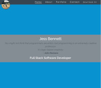
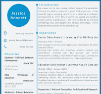
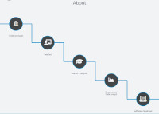
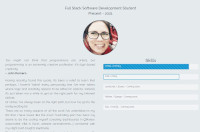

# Personal Portfolio
The purpose of my project was to create a personal website to showcase my work as a software developer and also to provide some background information on my career up to this point. Essentially, I wanted to create a ‘living’ CV. 

It is important to me that the site reflects my personality and doesn’t appear to be just a generic website. For this reason I have used several images of myself, and all text has been written in a conversational-style. 

The quote on the homepage (which also appears in the 'About' section) was something I came across on the Code Institute course. It resonates very strongly with me and I am hopeful that my site demonstrates a good balance between logic and creativity. 

Creating this project has been quite a learning curve. Not only with regards to putting into practice what I have learnt so far, but also in terms of understanding my way of working a lot better – and hopefully improving on this in future projects! 

I began building the site with quite a clear idea in my head. As can be seen in my [wireframe document](documentation/ucp-wireframe.pdf), I started out using a picture taken in the village where I grew up as my inspiration for the design (as part of the ‘reflection of my personality’ methodology). I used Adobe CC to create a palette based on this image, and was so pleased with the idea that I ignored the fact that I didn’t really like how the colours actually looked! I had also set upon a single-page site (which has caused me more issues than I first realised) and for some reason (which possibly made sense to me at the time, but doesn’t now!), set each section to be 100vh. 

About halfway through the project I realised my mistake on both these counts, and created a new index.html. I copied the code across line by line to make sure that I fully understood each design-decision I was making and at the same time, rectified those two major mistakes. Each section is no longer limited in height, which has helped enormously with the layout. And the colour palette, whilst still based on my original image, is a much more abstract take on the greens and blues of the countryside – and I think, more suited to the purpose of the site.

All these changes have meant that this project took quite a bit longer than I had anticipated. But for a first project, I have learnt a huge amount, which I hope will help the planning process for my next project.

### Lessons Learnt
* Start small and build up
    *  I was slightly too enthusiastic about getting to the 'fun (extra challenging)' parts and in hindsight I should have spent more time ensuring I was satisfied with the underlying format. This would have saved me a great deal of time that was spent going back and changing the colour scheme and layout.

* Pick a CSS naming convention and stick with it
    * I still have more to learn when it comes to the pros and cons of different naming conventions, although I did do plenty of reading around the subject before beginning the site. I have tried to use a consistent style throughout (mainly based on BEM) but I think some of my class names were a bit haphazard to begin with. 

* Thoroughly document external libraries
    * The JS took some trial and error to get it working, and I ended up with some unused libraries in place. Whilst I did make a note of those that I used in my wireframe document, I neglected to remove all of those that **didn't** work from my code and ended up with two unused libraries (now removed).

* Be wary of duplicating CSS rules
    * Again, I think this was an overload of enthusiasm that led to some needless repetition of rules. I am hopeful that I have now removed all of the duplications but in future, I realise that I need to be more careful of this!

## UX
The website has been built with prospective clients, recruiters, employers and collaborators in mind. Whilst a personal portfolio site is a fairly simple idea, I wanted it to appeal to different people for different reasons. Basically, I want something which is impressive, but more importantly, easy-to-understand for both technical and non-technical mindsets. 

With this mind, I have tried to ensure that the site is easy to navigate and that everything works and can be found where expected. But at the same time, many of the simple features include more complex programming to demonstrate what I have learnt so far. Examples of this are the animations used on the homepage and 'About' sections, and the post-card style contact form.

### User stories
* As a prospective client, I want to see an example of the type of website that could be created. I am less interested in the content itself, and more interested in the different features that have been implemented and the overall look of the site.  
 
* As a non-technical recruiter/employer, I am interested in the work history of the candidate and the availability of a hard-copy CV.  

* As technical recruiter/employer, I would like to see work history of the candidate and also see a demonstration of their programming ability.  

* As a prospective collaborator, I am interested in seeing the candidate’s programming ability and design choices.  

My [wireframe document](documentation/ucp-wireframe.pdf) further demonstrates how I attempted to meet the above requirements – with particular reference to the Strategy plane section.

## Features
### Existing Features
* Homepage – navbar
    * Responsive for desktop and mobile users. Allows all users to navigate to key sections of site.
* Homepage – navbar image
    * Keeps to ‘personal’ ethos of the site. Also allows user to quickly return to homepage.
* Homepage – main
    * Displays quote that has shaped the project. Animation added to enhance design.
* About – svg
    * Showcases work history in a visual manner (text provides additional information to the icons)
* About – modals
    * Gives further information about each stage of work history and the skills (those that I deem relevant to software development) gained. Icons have been given hover effect and pointer-cursor to indicate that they are clickable. 
* About – svg animation
    * Demonstrates additional programming ability. JS added to ensure that user sees animation, rather than it happening ‘invisibly’ whilst they are on another page. 
* Skills page
    * On desktop, this page replaces the ‘software developer’ modal to allow for a more detailed overview. On mobile, it is a smaller additional section with just the progress bars. Its purpose is to give a back story to my career path, and is also designed to be updated as I continue to progress as a software developer. I have purposefully used the 'Coming soon...' text to highlight my current stage of progression.
* Portfolio page
    * Showcases work as a software developer. Also designed to be regularly updated, and includes information regarding upcoming projects.
* Portfolio cards animation
    * Designed to save space on layout, and also to demonstrate additional programming ability. This section has changed quite a lot since its original inception! This is mainly a design choice. The masonry style didn’t work at all with the typically ‘square’ webpages I wanted to display. I have added additional information about the website on the reverse of each card. This is viewable on larger devices, but not on mobile.
* Contact page
    * Currently more of a design-feature since it’s not actually useable! I did try investigating php files to see whether I could make it fit for purpose, but felt that I was going down a path that was not relevant to the current project. Its hypothetical purpose is to provide a quick way for all users to get in touch.
* Footer
    * I have kept this quite minimal with just additional contact options and copyright notice.

### Abandoned Features (from strategy plane)
* Image when loading homepage
    * I decided against this as I felt it was overly complicated (visually-speaking), and decided to use the animated text on the homepage in its place
* Home image to show through modal
    * The idea behind this was to keep the image in place throughout, so it would still display when the menu modal was opened on mobile. However, I decided to make the menu modal narrower than the screen, and place to the right (in line with the hamburger icon), and so it didn’t make sense to have the home image shift over from its usual place.
* Email pop out to client
    * I realised this was relatively easy to implement. However, I didn’t like the fact that it took the user away from the site, and also seems pointless when I could just provide an email address instead.

### Features Left to Implement
* I originally wanted the hamburger icon to transition into the ‘close modal’ cross when clicked, via a rotation animation (rather than the cross just sitting on top of the hamburger). However, I have realised that this is more complex than I had originally anticipated and I am wary of undoing a lot of the design I am satisfied with, for the sake of a very small ‘nice-to-have’ feature. I may come back to this.
* Working contact form.
* Submit message on contact form – once the contact form is working correctly, I would like to change the current message box to one that indicates the user’s message has been sent successfully. 

## Technologies used
* [Bootstrap](https://getbootstrap.com/)
    * Bootstrap CSS and JS used for grid layout and modals
* [FontAwesome](https://fontawesome.com/)
    * FA JS used for icons. Initially, the CSS file was used but this didn't work for the SVG icons, so the JS file was used instead.
* [JQuery](https://developers.google.com/speed/libraries)
    * Used for menu active scroll function and animation on scroll function
* [Favicon](https://favicon.io/)
    * Used to create site’s favicon

## Testing

The first stage of testing was conducted by willing family members. This was to check usability - whether navigation was clear and user stories met.
Feedback regarding usability was good. Some errors were identified (mainly due to the different devices used for testing) and fixed. An overview of these can be found at the end of the [wireframe document](documentation/ucp-wireframe.pdf)
Code was tested using external sites. Functionality testing was carried out manually. 

### Code Testing

Testing was conducted via Validator.w3.org and jigsaw.w3.org/css-validator. Some errors were found during initial testing and fixed. Two warnings remain in place (one for html and one for css) however, no action has been taken on these as they do not affect the performance of the site. 
Full details can be found [here](documentation/ucp-testing-code.pdf)

### Functionality Testing

Functionality was tested across different device sizes and different browsers.

All test outcomes were good with some exceptions:

* Active scroll JS doesn't work for 'Contact' page as section is not big enough to be recognised (I believe this is the cause of the issue)
    * This is not being remedied at this time as it doesn't affect usability and my understanding of JavaScript is not yet sufficient for me to make any further changes to the code! 

* Icon background on 'About' page working on iPad2 but not iPad7
    * This issue remains unfixable by me, despite many attempts. Most recently I amended all animations to include all vendor prefixes (although animations work on all browsers except Safari with or without the prefixes). 
    However, this hasn't made any discernible difference.
    The issue is quite frustrating as I feel it impacts on the aesthetics and functionality of the page. But I have exhausted all avenues to fix this so far, so am regrettably leaving it until I am more able to understand the issue.

* Modal menu close on link click working intermittently
    * A similar issue to the one above, in terms of consistency and my ability to understand it! The modal menu has some JS included, as otherwise, it was necessary to click on the link and then close the modal, which I didn't think was very user-friendly. On some devices this functionality works, on others, it doesn't. 
    I haven't been able to find any pattern in when/where it does/doesn't work, so unfortunately I am having to leave it at this time. 

* Animation 'show on scroll' effect
    * This was tricky to implement as I have no knowledge of JS. However, I felt it was very important to include as the animations are pointless if they aren't seen (i.e. if they take place while the user is on another section of the site).
    I copied and adapted some code after lots of trial and error (see Acknowledgements for details) and I am fairly happy with how it works. 
    The main issue is that the animation delay continues to be taken into account if the animation starts and then stops. 
    So, if a user scrolls part way onto the 'About' page, the animation starts on whichever elements are in view. If the user then scrolls back up the page, before revisiting the 'About' page, any elements that were not previously in view (and therefore activated) now begin their animation, but still with the animation delay. This is not perfect, but again, I don't currently have the JS knowledge needed to get it to the standard I would like.

* Safari testing not carried out
    * It has not been possible for me to fully test the site on Safari at this time as I do not have a desktop Mac (some testing has been conducted on crossbrowsertesting.com). Therefore, whilst testing from a family member who owns a Mac has been reported to be 'good' in all cases, I don't feel enough confidence in this testing to report it here.
    Similarly with the issue betwen the iPad2 and iPad7 mentioned above: the iPad7 issue has been reported to me as I only have the iPad2 (which is obsolete so is stuck on an old version of Safari), so carrying out full tests on the issue has been difficult.

* Google dev tools v 'Real life' testing
    * I also found during testing that features would work on Google dev tools, but not on a similar device in 'real life'.
    This resulted in many additional commits where I would implement a change, and then have to push it to the live site in order to check. 
    I was keen to 'clean up' my commit history as I feel it could appear confusing. However, it was suggested to me by tutor support that it would be best to leave it rather than risk any major errors!

The full testing matrix with features tested and devices/browsers tested on, can be found here:  
* [Device size in development](documentation/ucp-testing-device-size-dev.pdf)
* [Device size in published version](documentation/ucp-testing-device-size-live.pdf)
* [Browser testing](documentation/ucp-testing-browser-live.pdf)

## Deployment

The site was deployed via GitHub Pages with the following steps:

1. From the repository, I visited 'settings'
2. Under 'GitHub pages', I changed the source to 'Master branch'

 The full website link is: https://jess-bennett.github.io/personal-portfolio/

## Credits

### Content/Media

All content and media was created by me.

### Acknowledgements

Other than a word of thanks to my family for their help with testing on different devices, I would like to acknowledge the following sites:

* Active menu JS 
    * Code taken from: https://www.steckinsights.com/change-active-menu-as-you-scroll-with-jquery/
* Close menu modal on anchor click 
    * https://stackoverflow.com/questions/13319678/can-i-close-the-bootstrap-modal-once-the-link-has-been-clicked    
* Show animation on scroll 
    * Code taken directly from: https://cssanimation.rocks/scroll-animations/ - removed section on ‘remove class’ as don’t want the animation to repeat    
* SVG 
    * Following articles used: https://medium.com/@sterling.meghan/svg-line-animation-for-beginners-51857c88357f and https://css-tricks.com/svg-path-syntax-illustrated-guide/ and https://www.w3schools.com/graphics/svg_line.asp and https://www.w3schools.com/graphics/svg_circle.asp and https://codepen.io/BruceBC/pen/PPPNQV and https://stackoverflow.com/questions/14984007/how-do-i-include-a-font-awesome-icon-in-my-svg
* Portfolio card 
    * Code lifted and adapted from: https://www.w3schools.com/howto/howto_css_flip_card.asp
* Overwriting autofill colour change in contact form 
    * https://webagility.com/posts/the-ultimate-list-of-hacks-for-chromes-forced-yellow-background-on-autocompleted-inputs
* Placeholder text colour for contact form
    * https://www.w3schools.com/howto/howto_css_placeholder.asp
* Contact form submission button JS
    * https://codepen.io/hanapiers/pen/EXNrGP and https://www.w3schools.com/jsref/tryit.asp?filename=tryjsref_form_reset   

